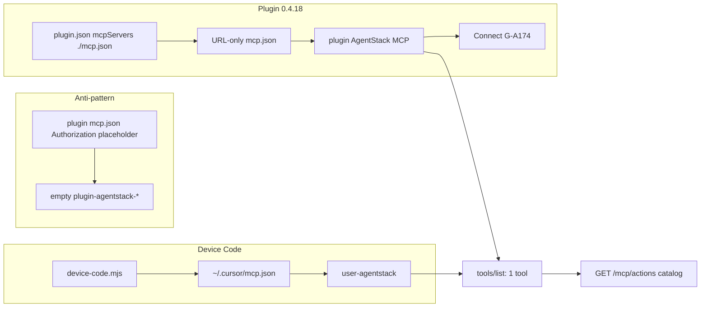

# Data & call flow — AgentStack Cursor plugin

**Gene:** `repo.plugins.oauth_device_code.gen1` · `repo.plugins.hooks.contract.gen1` · `repo.plugins.capability_routing.gen1`  
**Version:** 0.4.18 · Start here for install → MCP → hooks; one-pager: [MCP_QUICKSTART.md](MCP_QUICKSTART.md)

## Repo layout (Cursor 2.6+)

| Path | Role |
|------|------|
| `.cursor-plugin/marketplace.json` | **Required** for Cursor “Add marketplace” / GitHub install (`pluginRoot: plugins`, `source: agentstack`) |
| `.cursor-plugin/listing.json` | AgentStack publisher SoT (screenshots, privacy, pricing) — **not** Cursor’s marketplace schema |
| `plugins/agentstack/` | Plugin package: `plugin.json`, **URL-only `mcp.json`**, rules, skills, commands, agents, hooks, assets, vendored kernel |
| `scripts/` | Validate / smoke / local install tooling |

```mermaid
sequenceDiagram
  participant User
  participant Init as agentstack-init
  participant DC as device-code.mjs
  participant AS as agentstack.tech
  participant MCP as Cursor MCP client
  participant Hooks as hooks lifecycle
  participant Snap as agentstack-capabilities.json

  User->>Init: /agentstack-authorize (or sessionStart auto Device Code)
  Init->>DC: node hooks/scripts/device-code.mjs
  DC->>AS: POST /api/oauth2/device/authorize
  AS-->>DC: device_code + user_code
  User->>AS: /activate approve
  loop poll
    DC->>AS: POST /api/oauth2/token
    Note over AS: 400 + authorization_pending until approved
  end
  AS-->>DC: access_token (user PAT JWT + service_caps; no refresh_token)
  DC->>MCP: write ~/.cursor/mcp.json Bearer
  DC->>AS: POST /mcp/cache/clear
  DC->>AS: GET /mcp/actions
  DC->>Snap: flat actions[] snapshot
  Hooks->>MCP: sessionStart refresh only if a leftover refresh_token file exists (device grant returns a long-lived PAT)
  Hooks->>Snap: refresh if older than 24h
  MCP->>AS: agentstack.execute steps
  Note over MCP,AS: tools/list can succeed while tools/call fails (prod rejects JWT service_caps=null)
  Hooks->>Snap: beforeMCPExecution cap hint
```

## Artifacts on disk

| Path | Writer | Reader |
|------|--------|--------|
| `~/.cursor/mcp.json` | device-code, session-start | Cursor MCP, hooks |
| `~/.cursor/agentstack-refresh` | device-code, session-start | session-start |
| `~/.cursor/agentstack-capabilities.json` | device-code, session-start, capability-refresh | pre-mcp-cap-check, diagnose |
| `~/.cursor/agentstack-device.lock` | device-code | session-start, diagnose |
| `~/.cursor/agentstack-project` | /agentstack-login | device-code, session-start |
| `~/.cursor/agentstack-telemetry.jsonl` | post-tool-* (opt-in only) | session-end flush, diagnose |
| `~/.cursor/plugins/local/agentstack` | `scripts/install-local.mjs` | Cursor local plugins |
| `~/.cursor/plugins/cache/agentstack/…` | Cursor marketplace install | Cursor may prefer this over local — must not ship `$schema` |
| `~/.cursor/plugins/marketplaces/…` | Cursor “Add marketplace” snapshot | Same — refresh with `scripts/refresh-cursor-runtime.mjs --fix` |

## Catalog shape

Live `GET /mcp/actions` returns `{ domains: { [name]: Entry[] }, total_actions }`.  
Local snapshot stores **flat** `actions: Entry[]` via `tenantActionsFromCatalog` (tenant-facing filter; mirrors `doc_audience.py`).

Validate / CI uses vendored `docs/CAPABILITY_MATRIX.md` plus `scripts/lib/stale-actions.mjs` — **no monorepo-only imports** in the publish repo.

## Local health

```bash
node scripts/diagnose-local.mjs
node scripts/diagnose-local.mjs --fix --seed-snapshot
```

`sessionStart` (`--from-hook` from `hooks.json`) normalizes lean `mcpServers.agentstack` (drops ecosystem `X-Project-ID=1`, applies `agentstack-project` when it is a tenant), refreshes the flat capability snapshot using Bearer **or** `X-API-Key`, and **always** emits a compact auth/profile status card (`GET /api/auth/me` when signed in). If the gate still needs login it spawns `device-code.mjs` once (lock file) so Activate opens without pasting a key. Tests must not pass `--from-hook`. Logs go to stderr so stdout stays valid JSON. Stale Cursor marketplace cache is synced with `scripts/refresh-cursor-runtime.mjs --fix`. Same card: `/agentstack-status`.

## MCP registration plane (0.4.18)

**Plugin panel:** `plugin.json` `mcpServers: "./mcp.json"` → URL-only streamable-http (no Bearer). Cursor shows AgentStack MCP — click **Connect** (G-A174 login). **Hooks / Device Code:** `/agentstack-authorize` still writes `~/.cursor/mcp.json` (`user-agentstack`). **Forbidden:** `${AGENTSTACK_ACCESS_TOKEN}` or any `Authorization` in the shipped plugin `mcp.json` (G-A162), and an **inline** `mcpServers` object in `plugin.json`.



| Anti-pattern | Symptom | Fix |
|--------------|---------|-----|
| Empty Bearer in plugin `mcp.json` | `discovery.list` OK, execute unauthorized | 0.4.18 URL-only file; Reload; Connect |
| Inline `mcpServers` object in plugin.json | Duplicate / broken registration | Path string `./mcp.json` only |
| Stale marketplace cache | Old plugin without MCP or with placeholder | `refresh-cursor-runtime.mjs --fix` |
| Backend lists 2 tools | Two `agentstack_execute` in tools panel | Deploy core 0.4.16 |
| `projects.get_project` in chat | DNA `protected` / provider keys in the model transcript (G-A175) | Prefer `auth.get_profile` / `projects.get_stats`; list with `projects.get_projects` (`accessible_only` default, honor `limit`) |
| Cursor `mcp_auth` from the agent | Wrong client / login loop | User clicks **Connect** on plugin MCP (G-A174). Agent does not call `mcp_auth`. |

Plugin ships [`plugins/agentstack/mcp.json`](plugins/agentstack/mcp.json) (OAuth URL-only). User Device Code template: [`mcp.example.json`](mcp.example.json).

Full call/data map: [docs/plugins/MCP_DEDUPE_FLOW.md](../../docs/plugins/MCP_DEDUPE_FLOW.md).
