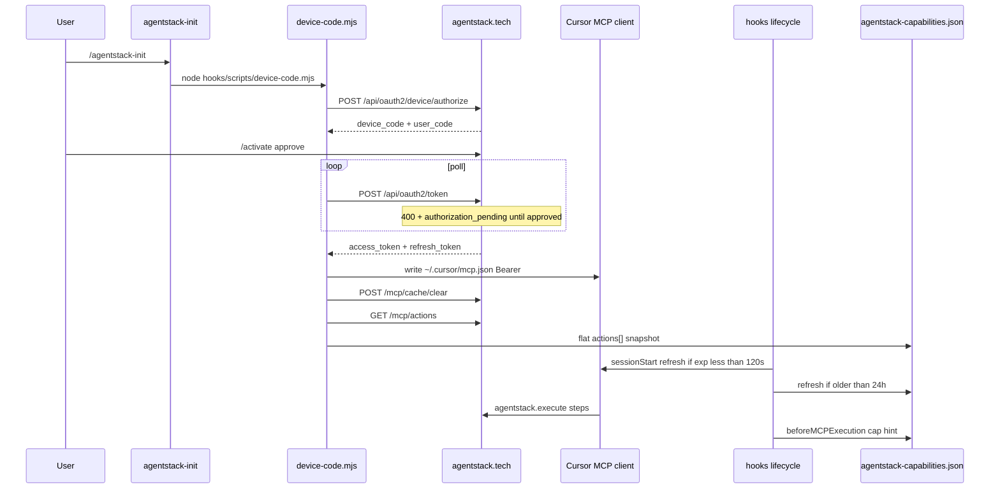

# Data & call flow — AgentStack Cursor plugin

**Gene:** `repo.plugins.oauth_device_code.gen1` · `repo.plugins.hooks.contract.gen1` · `repo.plugins.capability_routing.gen1`

## Repo layout (Cursor 2.6+)

| Path | Role |
|------|------|
| `.cursor-plugin/marketplace.json` | **Required** for Cursor “Add marketplace” / GitHub install (`pluginRoot: plugins`, `source: agentstack`) |
| `.cursor-plugin/listing.json` | AgentStack publisher SoT (screenshots, privacy, pricing) — **not** Cursor’s marketplace schema |
| `plugins/agentstack/` | Plugin package: `plugin.json`, rules, skills, commands, agents, hooks, mcp, assets, vendored kernel |
| `scripts/` | Validate / smoke / local install tooling |



## Artifacts on disk

| Path | Writer | Reader |
|------|--------|--------|
| `~/.cursor/mcp.json` | device-code, session-start | Cursor MCP, hooks |
| `~/.cursor/agentstack-refresh` | device-code, session-start | session-start |
| `~/.cursor/agentstack-capabilities.json` | device-code, session-start, capability-refresh | pre-mcp-cap-check, diagnose |
| `~/.cursor/agentstack-telemetry.jsonl` | post-tool-* (opt-in only) | session-end flush, diagnose |
| `~/.cursor/plugins/local/agentstack` | `scripts/install-local.mjs` | Cursor local plugins |

## Catalog shape

Live `GET /mcp/actions` returns `{ domains: { [name]: Entry[] }, total_actions }`.  
Local snapshot stores **flat** `actions: Entry[]` via `tenantActionsFromCatalog` (tenant-facing filter; mirrors `doc_audience.py`).

Validate / CI uses vendored `docs/CAPABILITY_MATRIX.md` plus `scripts/lib/stale-actions.mjs` — **no monorepo-only imports** in the publish repo.

## Local health

```bash
node scripts/diagnose-local.mjs
node scripts/diagnose-local.mjs --fix --seed-snapshot
```

`sessionStart` normalizes lean `mcpServers.agentstack` and refreshes the flat capability snapshot using Bearer **or** `X-API-Key`.
